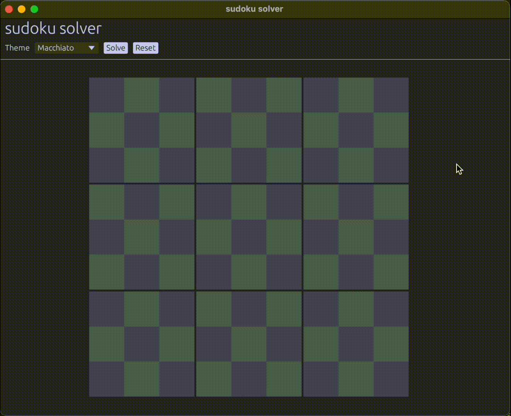

# sudoku-solver - [Website](https://projects.cameron.rs/sudoku-solver)



This Rust application implements a very memory efficent algorithm to solve sudoku and lets the user know when a unique solution does not exist.

## Algorithm

### [Source](src/solver.rs)

I create an enum that holds my result type so I can tell the user what went wrong or if it successfully solved the puzzle.
```rust
pub enum SolveResult {
    Unique,
    NotUnique,
    Invalid,
}
```
I create 3 bitfields that I use to store the numbers that a row, column, or box contains
```rust
pub fn solve_grid(grid: &mut Vec<Vec<Square>>) -> SolveResult {
    // These are the bit fields that keep track of the numbers placed in each row, column, and box of the grid
    let mut row: u128 = 0;
    let mut col: u128 = 0;
    let mut boxes: u128 = 0;

    for r in 0..9 {
        for c in 0..9 {
            if !grid[r][c].value.is_empty() {
```
`key` is calculated by left-shifting the binary value of 1 by a value between 0 and 8, depending on the digit in the cell
```rust
            let key = 1 << grid[r][c].value.chars().next().unwrap() as usize - '1' as usize;
```

`key` is then used to update the corresponding bit in the bit fields

**Example:**

If `key` is `000001000` then we have the 6th bit and we will shift it `r * 9` times and then use the OR bitwise operator to set that bit in `row`
```rust
                row |= key << r * 9;
                col |= key << c * 9;
                boxes |= key << (r / 3 * 3 + c / 3) * 9;
            }
        }
    }
   
    let mut count = 0;
    let old_grid = grid.clone();

    // We keep a solved_grid because we make sure that there is not a 2nd solution to the puzzle
    // If another solution doesn't exits then we set the grid equal to the solved_grid
    let mut solved_grid: Vec<Vec<Square>> = Vec::new();

    // Call the solving method recursively
    solve(&mut solved_grid, grid, &mut row, &mut col, &mut boxes, 0, &mut count);

    match count.cmp(&1) {
        Ordering::Equal => {
            *grid = solved_grid;
            SolveResult::Unique
        },
        Ordering::Greater => {
            *grid = old_grid;
            SolveResult::NotUnique
        }
        Ordering::Less => {
            *grid = old_grid;
            SolveResult::Invalid
        }
    }
}

fn solve(
    solved_grid: &mut Vec<Vec<Square>>, 
    grid: &mut Vec<Vec<Square>>,
    row: &mut u128,
    col: &mut u128,
    boxes: &mut u128,
    i: usize,
    count: &mut i32,
) -> bool {
    // If there is multiple solutions then automatically return true
    if *count > 1 {
        return true;
    }

    // If reached the end
    if i == 81 {
        // We need to save the grid in the case that we do not find another solution to the puzzle
        if *count == 0 {
            *solved_grid = grid.clone();
        }

        *count += 1;
        return false;
    }
```
Since we have a total sum, `i`, we use it to get the row, column, and later on, the box
```rust
    // Get the index of the row and column
    let (r, c) = (i / 9, i % 9);

    // If the cell is not empty then move to the next cell
    if !grid[r][c].value.is_empty() {
        return solve(solved_grid, grid, row, col, boxes, i + 1, count);
    }

    // Box index
    let b = (r / 3) * 3 + (c / 3);
```
`mask` is a bit mask that represents the numbers that are already present

We shift to the right to align each bits with the corresponding row, column, and box
```rust
    let mask = (*row >> r * 9) | (*col >> c * 9) | (*boxes >> b * 9);
```

We loop through each possible number

Using `xmask` we check to make sure that the bit has not been set in the row, column, or box.

If it equals `0` then we know that we can start trying to solve for that specific cell
```rust
    for x in 0..9 {
        let xmask = 1 << x;
        if mask & xmask != 0 {
            continue;
        }
```
Using the same concept from setting up `row`, `col`, and `boxes` we update the xth bit so we can begin to test
```rust
        // We update the bit at the current x value using xmask
        *row |= xmask << r * 9;
        *col |= xmask << c * 9;
        *boxes |= xmask << b * 9;

        // Since its 0-8 then we do x+1
        grid[r][c].value = std::char::from_digit(x + 1, 10).unwrap().to_string();
        grid[r][c].solved_cell = true;
        // Recursively call itself with the next cell to check if the value works
        if solve(solved_grid, grid, row, col, boxes, i + 1, count) {
            return true;
        }
```
If the value did not work then we undo the changes we made to the xth bit
```rust
        // If it didnt work then we reset the changes we did to the bit fields
        *row ^= xmask << r * 9;
        *col ^= xmask << c * 9;
        *boxes ^= xmask << b * 9;

        grid[r][c].value = String::new();
        grid[r][c].solved_cell = false;
    }
    
    false
}
```

